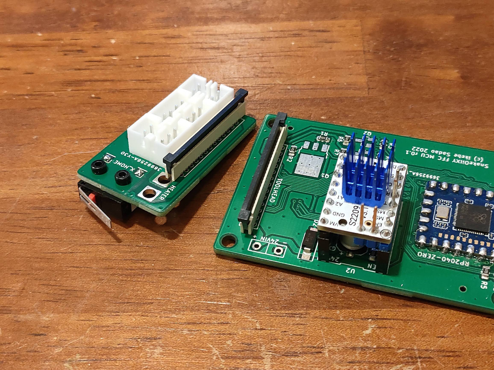
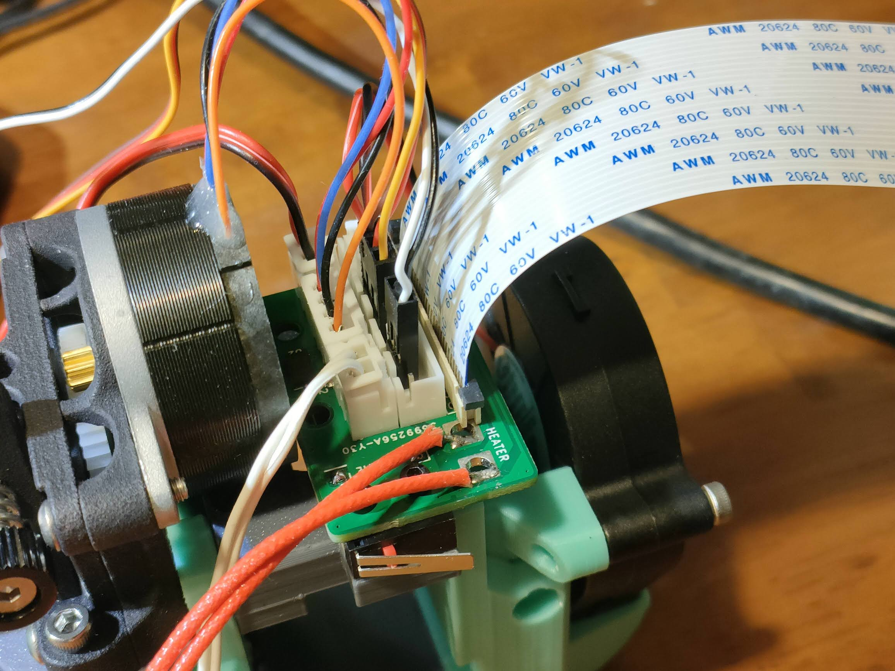
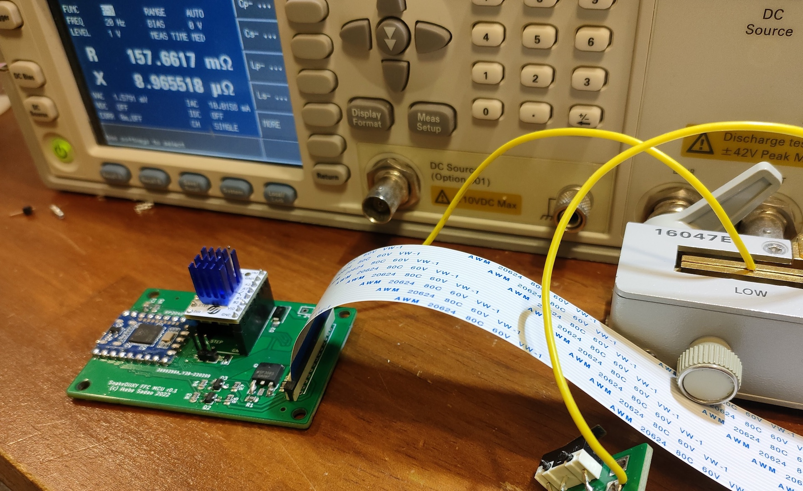
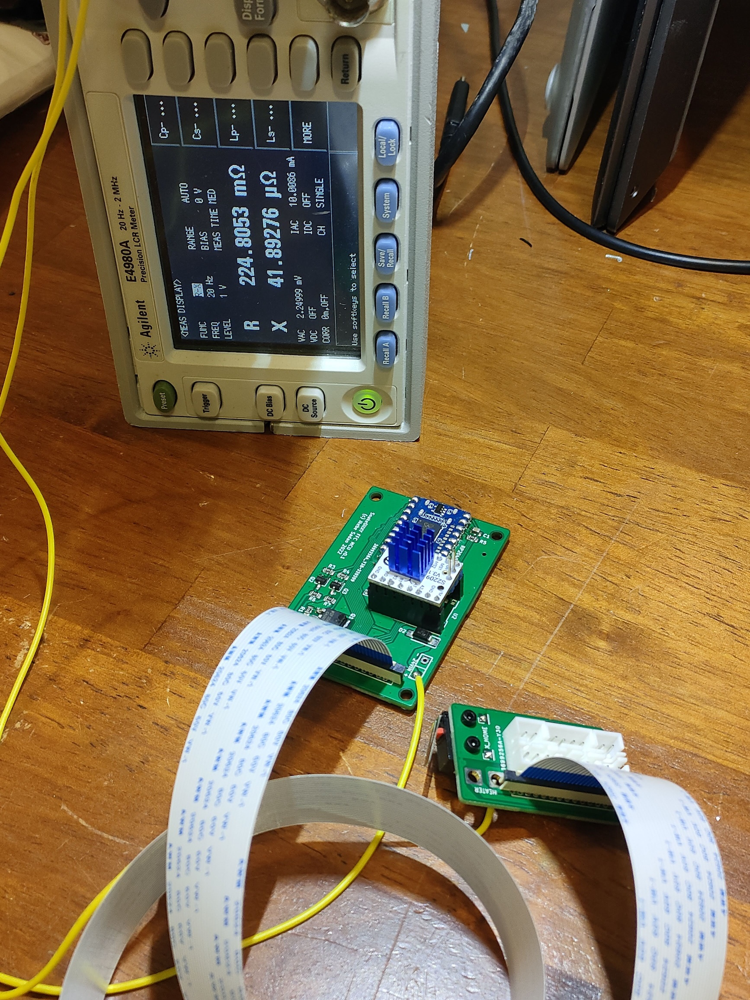

# FFC mod for SnakeOilXY 3-D printer

These boards are to simplify the connection to the toolhead of SnakeOil-XY 3D printer.
It is a set of MCU board and a board for tool head.

I've designed boards that provide following functions:

* Heater (24V50W)
* Heater Thermistor
* Hotend Fan (24V)
* Part Fan (24V)
* X Endstop
* BLTouch (or 24V inductive probe)
* Extruder stepper
* Accelerometer ADXL345 (on-board)

In order to reduce the number of contacts as much as possible, I also created an MCU board. This system is compatible only with Klipper.
In the future, I may make it possible to connect via CAN bus so that it can work with RRF, etc.

The MCU board needs to be connected to the Raspberry Pi via USB and supplied with 24V power, and the TMC2209 driver needs to be inserted.
A 1.0mm pitch 26-pin 20624 FFC cable is used.

* Connection of the heater

The heater is assumed to be a 24V 50W, using 4 FFC cable contacts in parallel. Approx. 500mA current flows per contact.
Resistance of the heater wire was 266mΩ round trip - with a 600mm cable - which is measured by four-terminal-pair method of Agilent E4980A. 
When a 24V 50W heater is used, there is a loss of about 1W including circuits, cable and contacts. (225mΩ for 53cm of lead wire, 157mΩ for 14cm of lead wire, so the loss in the circuit and FFC is 133mΩ. 266mΩ round trip. This resistance value includes the resistance of four contacts on the fixture side.)

* Defects

In r0.1, the Drain and Source connections of the MOSFETs of the heater were reversed, so I changed the connections.
Also, the clearance between the power supply/heater terminals and other parts are not enough. It needs to be changed to increase the clearance.
