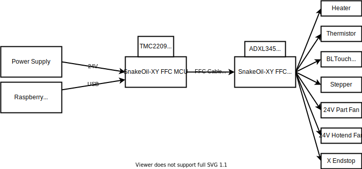
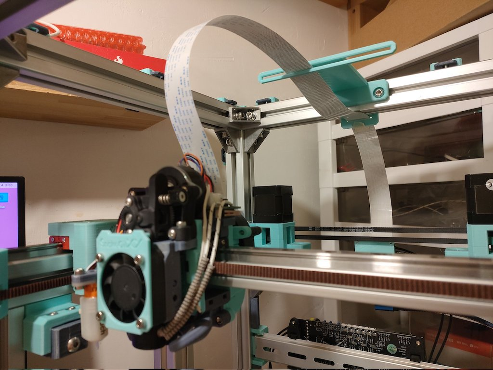
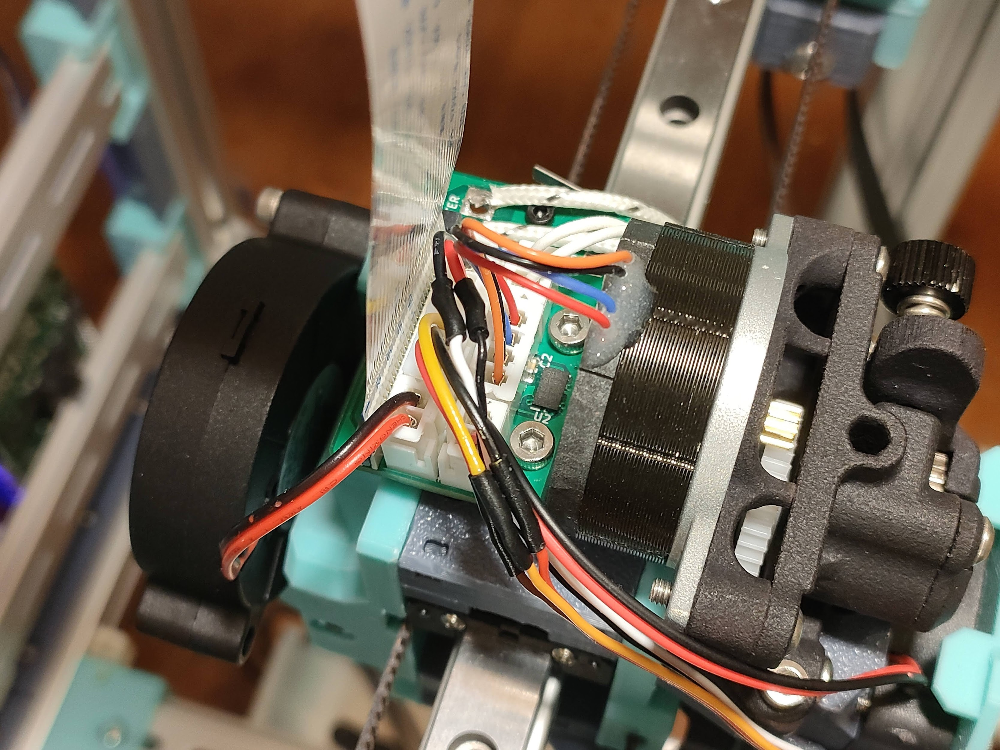
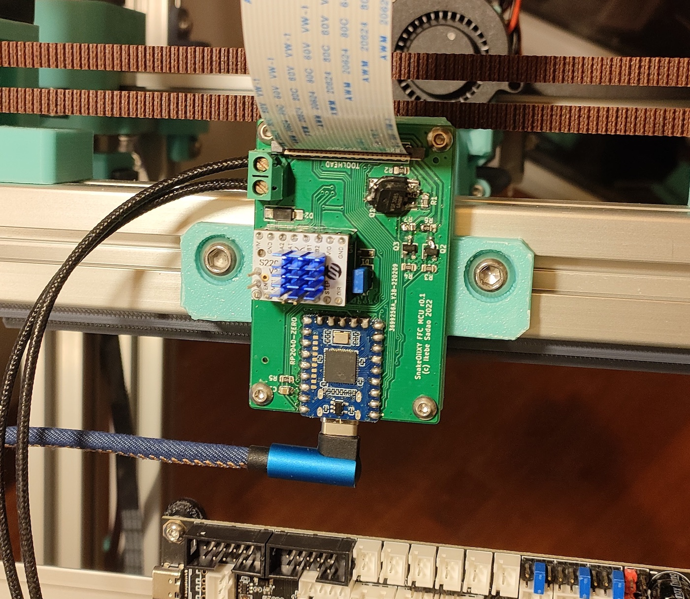
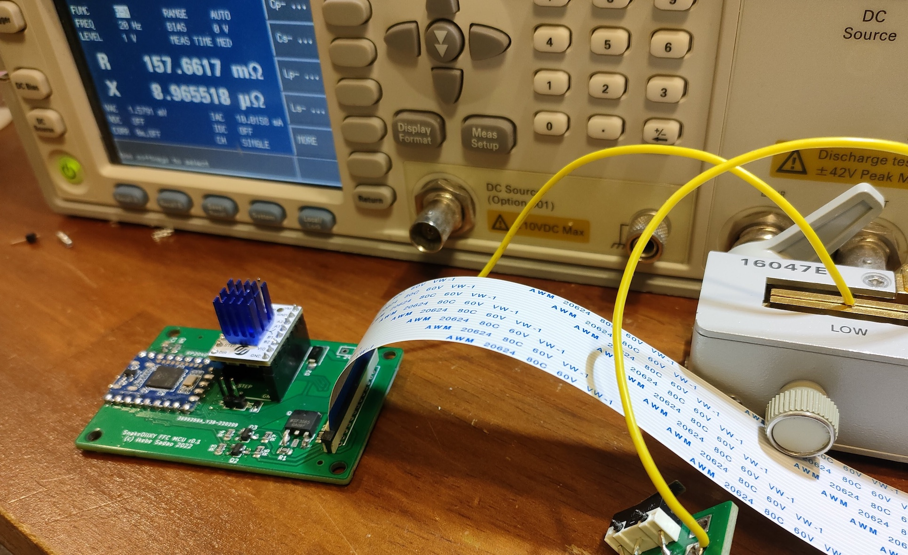
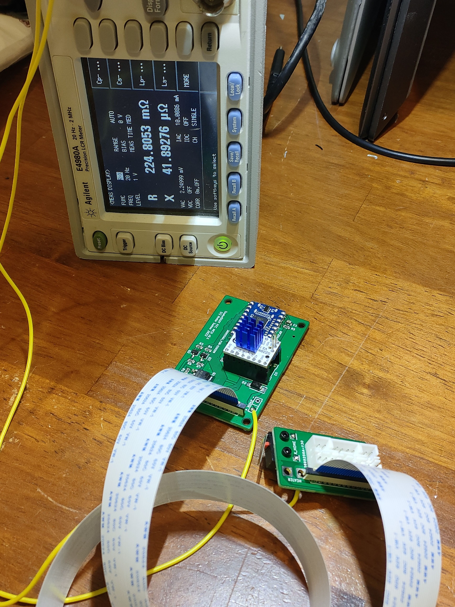
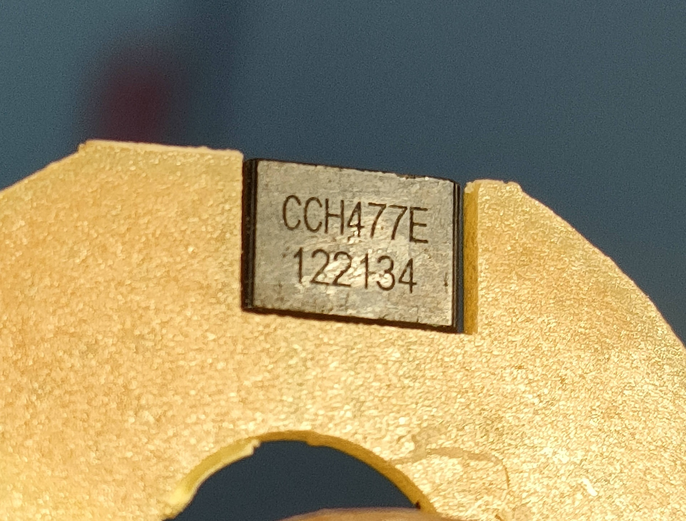
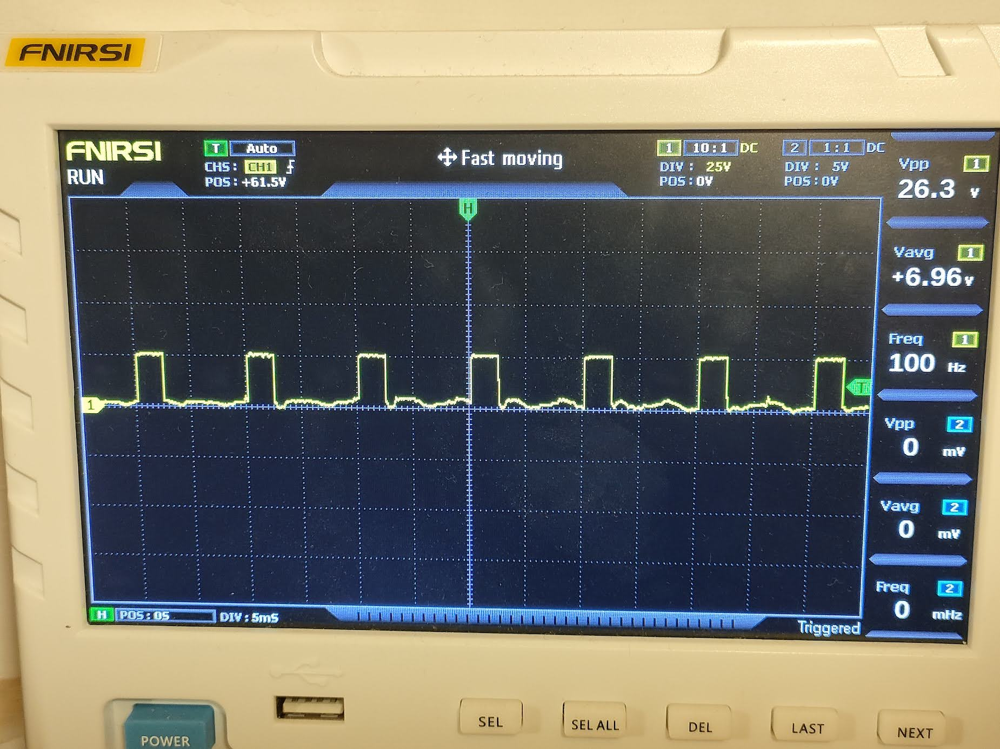

# FFC mod for SnakeOil-XY 3-D printer

This is a toolhead PCB suite for SnakeOil-XY 3-D printer.
* It has a dedicated MCU and is connected to the toolhead by a dedicated ribbon cable, which makes connection simpler and also makes toolhead lighter.
* It gives full functionality of toolhead while it only needs USB wire and 24V power supply connected to the MCU board.
* It has an ADXL345 accelerometer on-board, which makes wiring even simpler.
* It has an X endstop on board, which fits SnakeOilXY toolhead dimension.
* This system is compatible only with Klipper.

## Toolhead

It's an ordinary toolhead PCB with an ADXL345 accelerometer on-board, and it has an X endstop which fits SnakeOil-XY toolhead dimension. This toolhead PCB can be attached onto adxl_mount to replace the ADXL345 PCB.

## MCU Board

In order to have less contacts and make wiring easier, I also designed a MCU board exclusive for this FFC config. The MCU board just needs to be connected to the Raspberry Pi via USB and supplied with 24V power. A 1.0mm pitch 26-pin 20624 FFC cable is used.

## Klipper configuration

It assumes multi-mcu functionality of klipper firmware.

[sample printer.cfg](klipper/sample_printer.cfg)

## BOM

* RP2040-Zero
* 26-pin 600mm 20624 FFC cable
* 26-pin vertical thru-hole FFC receptacle
* 2x WSF3085 (MOSFET Heater)
* 2x PL4009 (MOSFET Fan)
* Stepper driver TMC2209 or other
* DC Terminal
* TVS diode, schottky diode
* 2x 8-pin socket (for stepper driver)
* Jumper pins
* Capacitors, resistors
* XH2.54 sockets (3x 2pin, 2x 3pin, 1x 4pin)

## Defects

### r0.1

* The Drain and Source connections of the MOSFETs of the heater were reversed --> I changed the connections.
* TVS diode are reversed --> Thankfully JLCPCB engineer fixed it. Need to rotate next time.
* The clearance between the power supply/heater terminals and other parts are not enough --> Need increase the clearance.

## Heater connection

The heater is assumed to be a 24V 50W, using 4 FFC cable contacts in parallel. Approx. 500mA current flows per contact.
Resistance of the heater wire is 266mΩ round trip including four screw terminals of 24V power supply and a 600mm FFC cable - which is measured by four-terminal-pair method.
When a 24V 50W heater is used, there is a loss of about 1W including circuits, cable and contacts. (225mΩ for 53cm of lead wire, 157mΩ for 14cm of lead wire, so the loss in the circuit and FFC is 133mΩ. 266mΩ round trip. This resistance value includes the resistance of four contacts on the fixture)

## DC Motor Circuit

The DC motor control circuit uses MOSFETs for low-side switching. Positive terminal of the motor is always connected to the 24V power supply, and the negative terminal is controlled by the MOSFET. This circuit doesn't have a diode to dissipate counter EMF (usually called as a flyback diode). This is because DC brushless motors generally have a full bridge driver in it, and the counter EMF does not return to the primary circuit. With an oscilloscope we can confirm that no counter EMF returns to the primary circuit.

### A poor-quality driver might still return counter EMF, so wouldn't it be a good idea to have a diode just in case?
No. I doubt that a driver which leaks counter EMF to the primary circuit can properly spin the fan for the first place... Many existing MCU boards (BTT, Mellow, FYSETC...) don't employ such diodes. It is not a good idea to increase the complexity of the circuit while gain no additional protection.
