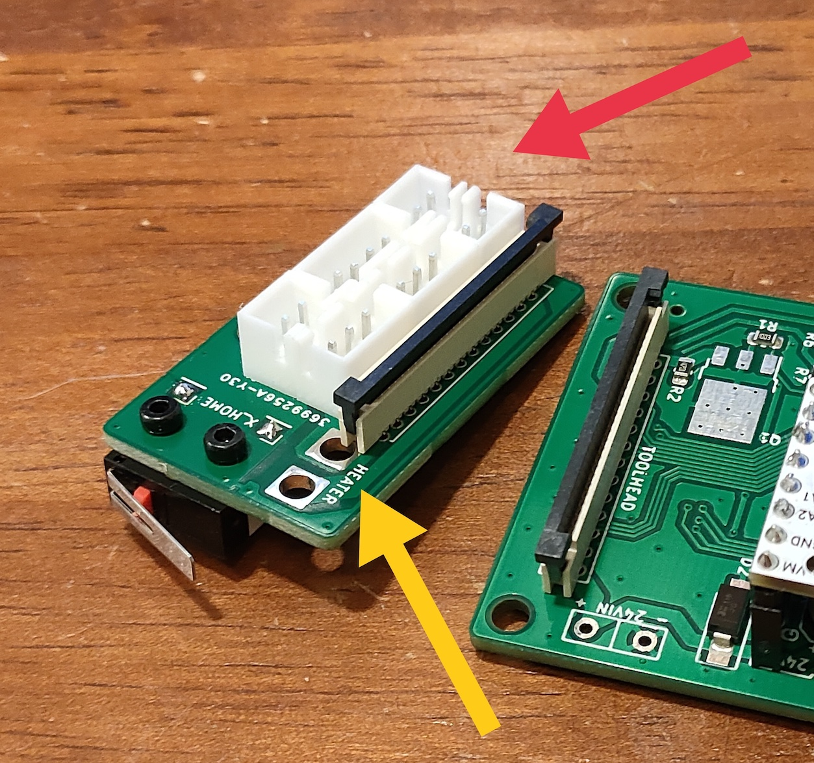

# FFC mod for SnakeOil-XY 3-D printer

This is a toolhead PCB suite for SnakeOil-XY 3-D printer.
* It has a dedicated MCU and is connected to the toolhead by a dedicated ribbon cable, which makes connection simpler and also makes toolhead lighter.
* It gives full functionality of toolhead while it only needs USB wire and 24V power supply connected to the MCU board.
* It has an ADXL345 accelerometer on-board, which makes wiring even simpler.
* It has an X endstop on board, which fits SnakeOilXY toolhead dimension.
* This system is compatible only with Klipper.

## Toolhead

It's an ordinary toolhead PCB with an ADXL345 accelerometer on-board, and it has an X endstop which fits SnakeOil-XY toolhead dimension. This toolhead PCB can be attached onto adxl_mount to replace the ADXL345 PCB.

### Toolhead board Assembly

Tricky steps are:

* The two rows of the connectors are close, so two rows of connectors must be installed facing each other. Therefore, the positive and negative terminals for the hotend fan and the part cooling fan are different. (red arrow in the picture)
* One of the heater terminals is too close to the FFC connector, so unfortunately, KFxxx-type screw terminal block wouldn't fit. Heater cables should be soldered. I think it won't be much of a problem because it's still able to disassemble without solder iron - loosening the bolt on the hotend will do the job. (yellow arron in the picture)
* Bypass capacitor C2 is in the way of the stepper 4-pin connector. The bottom side of the stepper connector needs to be chamfered a little.
* It has Bltouch(servo) and Zmin(probe) connectors in order to use Z probes. Bltouch, inductive probe, or klicky probe can be used. These connectors have cable colors printed on the silk, but once the connectors are soldered, the silk becomes unreadable. The Zmin(probe) connector has 24V power in it. Bltouch uses both servo and Zmin connectors except the 24V pin. As for inductive/klicky probes, servo connector can be left open. Using 3-pin probe connector (24V, Zmin, GND) is enough.
The MCU board has schottky diode on it, so 24V probe can be connected to Zmin pin without frying the MCU.

## MCU Board (revision 2)

In order to have less contacts and make wiring easier, I also designed a MCU board exclusive for this FFC config. The MCU board just needs to be connected to the Raspberry Pi via USB and supplied with 24V power. A 1.0mm pitch 26-pin 20624 FFC cable is used.

For the extruder motor drivers, the current circuit configuration only supports UART-connected smart drivers (like TMC2209). SPI connection is not supported. The photo shows a FYSETC driver, but other manufacturers' drivers may also be used.

FFC connector can be soldered to either the front or back side of the board. Considering cooling and wiring, it's better to place it on the back side.

This board has schottky diode on it, so 24V probe can be connected to Zmin pin without frying the MCU.

## Klipper configuration

It assumes multi-mcu functionality of klipper firmware.

[sample printer.cfg](klipper/sample_printer.cfg)

## BOM

* RP2040-Zero
* 26-pin 350mm (180 model) / 450mm (250 model) 20624 FFC cable
* 2x 26-pin vertical thru-hole FFC receptacle
* 2x WSF3085 (MOSFET Heater)
* 2x PL4009 (MOSFET Fan)
* Stepper driver TMC2209 or other (UART connected "smart" drivers are must)
* 2-pin DC Terminal (KF128) for 24V power supply
* TVS diode (SMAJ28A) , schottky diode (1N5819) 40V
* 2x 8-pin socket (for stepper driver)
* Jumper pins
* Capacitors, resistors
* XH2.54 sockets (3x 2pin, 2x 3pin, 1x 4pin)

## Defects

### r0.1

* The Drain and Source connections of the MOSFETs of the heater were reversed --> I changed the connections.
* TVS diode are reversed --> Thankfully JLCPCB engineer fixed it. Need to rotate next time.
* The clearance between the power supply/heater terminals and other parts are not enough --> Need increase the clearance.

## Heater connection

The heater is assumed to be a 24V 50W, using 4 FFC cable contacts in parallel. Approx. 500mA current flows per contact.
Resistance of the heater wire is 266mΩ round trip including four screw terminals of 24V power supply and a 600mm FFC cable - which is measured by four-terminal-pair method.
When a 24V 50W heater is used, there is a loss of about 1W including circuits, cable and contacts. (225mΩ for 53cm of lead wire, 157mΩ for 14cm of lead wire, so the loss in the circuit and FFC is 133mΩ. 266mΩ round trip. This resistance value includes the resistance of four contacts on the fixture)

## DC Motor Circuit

The DC motor control circuit uses MOSFETs for low-side switching. Positive terminal of the motor is always connected to the 24V power supply, and the negative terminal is controlled by the MOSFET. This circuit doesn't have a diode to dissipate counter EMF (usually called as a flyback diode). This is because DC brushless motors generally have a full bridge driver in it, and the counter EMF does not return to the primary circuit. With an oscilloscope we can confirm that no counter EMF returns to the primary circuit.

### A poor-quality driver might still return counter EMF, so wouldn't it be a good idea to have a diode just in case?
Many existing MCU boards (BTT, Mellow, FYSETC...) don't employ such diodes.

