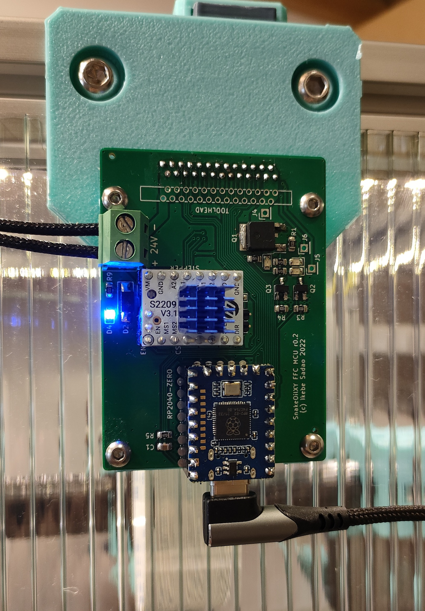

# FFC mod for SnakeOil-XY 3-D printer

These boards are for SnakeOil-XY 3-D printer. It makes connection to the toolhead simpler.
It consists of two PCBs: a tool head board and a MCU board. This system is compatible only with Klipper.

## Toolhead

FFC cable aside, it's an ordinary toolhead PCB with an ADXL345 accelerometer on-board, and it has an X endstop dedicated to SnakeOil-XY. This toolhead PCB can be directly replaced in place of the ADXL345 PCB.

## MCU Board

In order to reduce contacts and wiring labor (rather than connecting around 20 wires from primary MCU), I also designed a MCU board exclusive for this FFC config The MCU board just needs to be connected to the Raspberry Pi via USB and supplied with 24V power. A 1.0mm pitch 26-pin 20624 FFC cable is used.

## Klipper configuration

It assumes multi-mcu functionality of klipper firmware.

[sample printer.cfg](klipper/sample_printer.cfg)

## Heater connection

The heater is assumed to be a 24V 50W, using 4 FFC cable contacts in parallel. Approx. 500mA current flows per contact.
Resistance of the heater wire is 266mΩ round trip including four screw terminals of 24V power supply and a 600mm FFC cable - which is measured by four-terminal-pair method of Agilent E4980A. 
When a 24V 50W heater is used, there is a loss of about 1W including circuits, cable and contacts. (225mΩ for 53cm of lead wire, 157mΩ for 14cm of lead wire, so the loss in the circuit and FFC is 133mΩ. 266mΩ round trip. This resistance value includes the resistance of four contacts on the fixture)

## BOM

* RP2040-Zero
* 26-pin 600mm 20624 FFC cable
* 26-pin vertical thru-hole FFC receptacle
* 2x WSF3085 (MOSFET Heater)
* 2x PL4009 (MOSFET Fan)
* Stepper driver TMC2209 or other
* DC Terminal
* TVS diode, schottky diode
* 2x 8-pin socket (for stepper driver)
* Jumper pins
* Capacitors, resistors
* XH2.54 sockets (3x 2pin, 2x 3pin, 1x 4pin)

## Defects

### r0.1

* The Drain and Source connections of the MOSFETs of the heater were reversed --> I changed the connections.
* TVS diode are reversed --> Thankfully JLCPCB engineer fixed it. Need to rotate next time.
* The clearance between the power supply/heater terminals and other parts are not enough --> Need increase the clearance.

